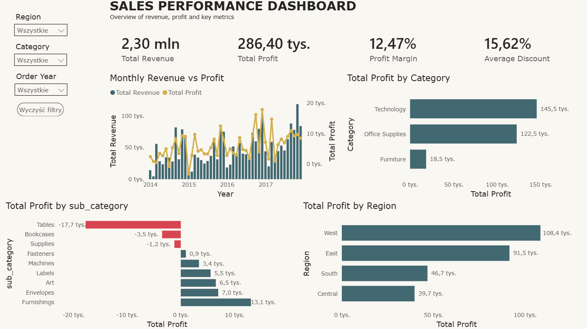

# 📊 Sales Performance Analysis (FMCG / Retail)

## 📁 Project Files  

- `sales_performance_dashboard.pbix` – Power BI dashboard  
- `sales_analysis.sql` – SQL queries and business analysis  
- `dashboard.png` – dashboard preview  

---

## 📊 Dashboard Preview  

---

## 🎯 Business Problem  

**EN:**  
The company generated strong sales revenue, however some product categories and regions achieved low profitability or even financial losses.

The goal of the analysis was to identify:

- profitable and unprofitable product categories
- impact of discounts on profitability
- regional sales performance
- trends in revenue and profit

**PL:**  
Firma generowała wysoką sprzedaż, jednak część kategorii i regionów osiągała niską rentowność lub nawet straty.

Celem analizy było określenie:

- najbardziej i najmniej rentownych kategorii produktów
- wpływu rabatów na rentowność
- efektywności regionów
- trendów sprzedaży i zyskowności

---

## 🛠 Tools & Technologies  

- SQL Server  
- Power BI  

---

## 🧠 SQL Highlights  

**EN:**  

- Data cleaning and preparation  
- Creation of staging and analytical tables  
- Revenue, profit and margin calculations  
- Aggregation by category, sub-category and region  
- Profitability analysis and business insights generation  

**PL:**  

- Czyszczenie i przygotowanie danych  
- Tworzenie tabel stagingowych i analitycznych  
- Wyliczanie revenue, profit oraz margin  
- Agregacja danych według kategorii, subcategory i regionów  
- Analiza rentowności oraz generowanie wniosków biznesowych  

---

## 📈 Key Insights  

**EN:**  

- High revenue did not always generate high profit  
- Higher discounts negatively affected profitability  
- Furniture category generated strong revenue but weak margins  
- Tables and Bookcases subcategories generated financial losses  
- Technology achieved the highest profitability  
- West region achieved the strongest performance and margins  

👉 Revenue growth alone did not guarantee profitability.

**PL:**  

- Wysoka sprzedaż nie zawsze przekładała się na wysoki profit  
- Wyższe rabaty negatywnie wpływały na rentowność  
- Kategoria Furniture generowała wysoki revenue przy niskiej marży  
- Subcategories Tables i Bookcases generowały straty  
- Technology osiągała najwyższą rentowność  
- Region West osiągał najwyższą efektywność i marżę  

👉 Wzrost sprzedaży nie gwarantował wzrostu rentowności.

---

## 📌 Business Impact  

**EN:**  

The analysis highlighted weak-performing product areas and showed that aggressive discount strategies may reduce profitability.

The dashboard can support:

- pricing optimization
- category management
- profitability monitoring
- regional performance analysis

**PL:**  

Analiza wskazała problematyczne obszary sprzedaży oraz pokazała, że agresywna polityka rabatowa może obniżać rentowność.

Dashboard może wspierać:

- optymalizację cen
- zarządzanie kategoriami
- monitoring rentowności
- analizę regionów

---

## 🚀 Recommendations  

**EN:**  

- Review discount strategy for low-margin products  
- Focus on highly profitable categories  
- Monitor loss-generating subcategories  
- Optimize regional sales strategy  

**PL:**  

- Weryfikacja polityki rabatowej dla nierentownych produktów  
- Koncentracja na najbardziej rentownych kategoriach  
- Monitoring nierentownych subcategories  
- Optymalizacja strategii regionalnej  

---

## 💡 About the Project  

**EN:**  

This project was created as part of a data analytics portfolio to demonstrate SQL analysis, business intelligence, and dashboard storytelling skills.

**PL:**  

Projekt został wykonany jako część portfolio Data Analyst, prezentując umiejętności SQL, analizy biznesowej oraz tworzenia dashboardów w Power BI.
